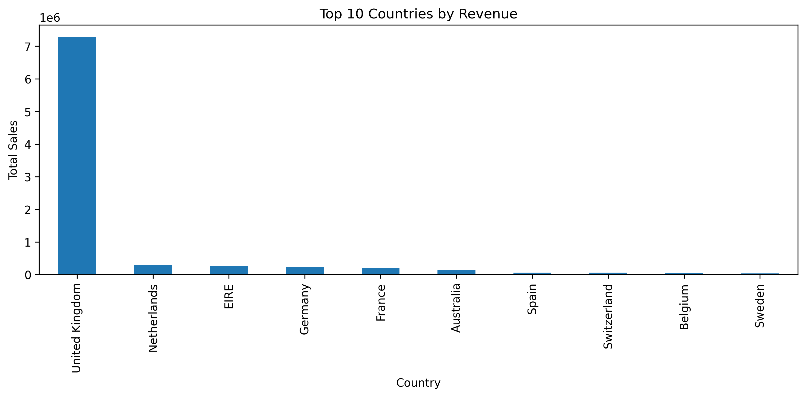
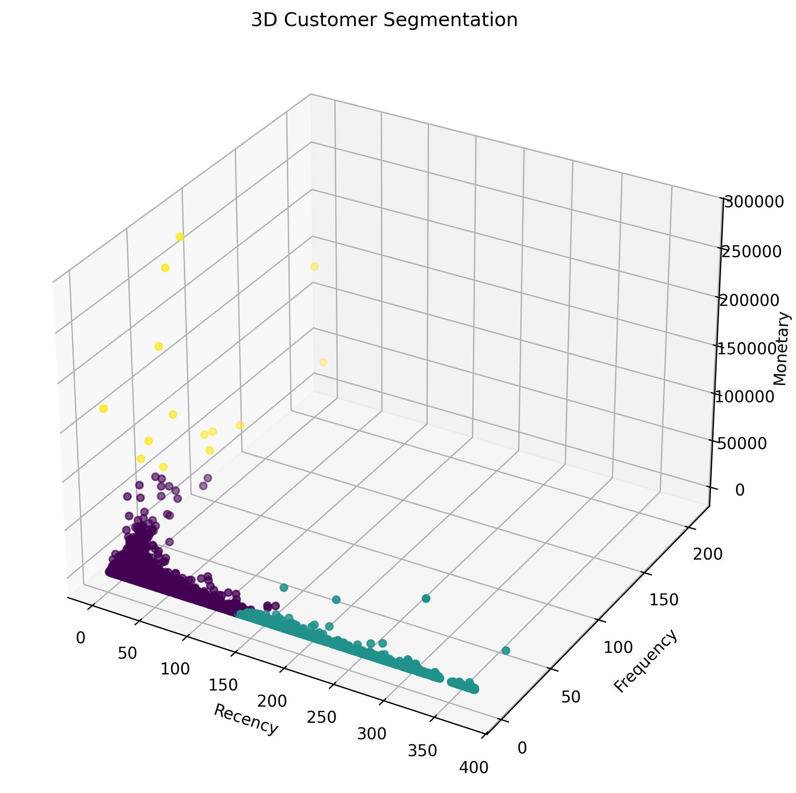

# GitHub Repository Setup Guide

## Project: Customer Behavior Analysis in Online Retail

Complete step-by-step instructions to initialize and push your project to GitHub.

---

## Prerequisites

Before you begin, ensure you have:
- [ ] Git installed on your system ([download](https://git-scm.com/downloads))
- [ ] A GitHub account ([create one](https://github.com/signup))
- [ ] Opened Terminal/PowerShell in your project directory
- [ ] All project files are in the `Customer-Behavior-Analysis` folder

**Verify Git installation:**
```bash
git --version
```

**Configure Git (do this once):**
```bash
git config --global user.name "Your Name"
git config --global user.email "your.email@example.com"
```

---

## Step-by-Step Setup Instructions

### Step 1: Initialize Local Git Repository

Navigate to your project folder and initialize Git:

```bash
cd c:\Users\ELCOT\Desktop\Customer-Behavior-Analysis
git init
```

**Expected output:**
```
Initialized empty Git repository in C:\Users\ELCOT\Desktop\Customer-Behavior-Analysis\.git/
```

---

### Step 2: Add All Project Files to Git

Stage all files for commit:

```bash
git add .
```

**Verify files are staged:**
```bash
git status
```

**Expected output:**
```
On branch master

No commits yet

Changes to be committed:
  new file:   .gitignore
  new file:   README.md
  new file:   requirements.txt
  new file:   data/online_retail.csv
  new file:   notebook/Customer_Behavior_Analysis.ipynb
```

---

### Step 3: Create Initial Commit

Commit your files with a descriptive message:

```bash
git commit -m "Initial commit - Customer Behavior Analysis project"
```

**Expected output:**
```
[master (root-commit) abc1234] Initial commit - Customer Behavior Analysis project
 5 files changed, 15000 insertions(+)
 create mode 100644 .gitignore
 create mode 100644 README.md
 create mode 100644 requirements.txt
 create mode 100644 data/online_retail.csv
 create mode 100644 notebook/Customer_Behavior_Analysis.ipynb
```

---

### Step 4: Rename Branch to 'main'

Modern GitHub uses 'main' as the default branch:

```bash
git branch -M main
```

**Verify:**
```bash
git branch
```

**Expected output:**
```
* main
```

---

### Step 5: Create GitHub Repository

1. **Go to GitHub**: https://github.com/ (sign in if needed)
2. **Click the "+" icon** in the top-right corner
3. **Select "New repository"**
4. **Configure your repository**:
   - **Repository name**: `Customer-Behavior-Analysis`
   - **Description**: "Customer Behavior Analysis in Online Retail - Data Science Project"
   - **Visibility**: Public (to showcase on portfolio) or Private (for personal use)
   - **Do NOT initialize** with README, .gitignore, or license (you already have files)
5. **Click "Create repository"**

**You'll see this screen with commands. Copy the repository URL.**

---

### Step 6: Add Remote Repository

Link your local repository to GitHub:

```bash
git remote add origin <YOUR_REPOSITORY_URL>
```

**Replace `<YOUR_REPOSITORY_URL>` with your actual URL**

Example:
```bash
git remote add origin https://github.com/your-username/Customer-Behavior-Analysis.git
```

**Verify the remote:**
```bash
git remote -v
```

**Expected output:**
```
origin  https://github.com/your-username/Customer-Behavior-Analysis.git (fetch)
origin  https://github.com/your-username/Customer-Behavior-Analysis.git (push)
```

---

### Step 7: Push to GitHub

Upload your repository to GitHub:

```bash
git push -u origin main
```

**Expected output:**
```
Enumerating objects: 5, done.
Counting objects: 100% (5/5), done.
Delta compression using up to 8 threads
Compressing objects: 100% (4/4), done.
Writing objects: 100% (5/5), ...
remote: Create a pull request for 'main' on GitHub by visiting:
remote: https://github.com/your-username/Customer-Behavior-Analysis/pull/new/main
To https://github.com/your-username/Customer-Behavior-Analysis.git
 * [new branch]      main -> main
Branch 'main' is set up to track remote branch 'main' from 'origin'.
```

**Congratulations! Your repository is now on GitHub!** 🎉

---

## Quick Command Reference

### For Complete Beginners

Copy and paste these commands one-by-one:

```bash
# 1. Navigate to project
cd c:\Users\ELCOT\Desktop\Customer-Behavior-Analysis

# 2. Initialize Git
git init

# 3. Add all files
git add .

# 4. Create first commit
git commit -m "Initial commit - Customer Behavior Analysis project"

# 5. Rename to main branch
git branch -M main

# 6. Add remote (REPLACE with your GitHub URL)
git remote add origin https://github.com/YOUR_USERNAME/Customer-Behavior-Analysis.git

# 7. Upload to GitHub
git push -u origin main
```

---

## After Initial Setup: Working with Your Repository

### Making Changes & Committing

```bash
# Check status
git status

# Add specific file
git add notebook/Customer_Behavior_Analysis.ipynb

# Or add all changes
git add .

# Commit changes
git commit -m "Description of what you changed"

# Push to GitHub
git push origin main
```

### Example Workflow After Running the Notebook

```bash
# After running your notebook and getting results:
git add images/
git commit -m "Add generated visualization images"
git push origin main
```

### Create Additional Branches for Experiments

```bash
# Create new branch
git checkout -b feature/new-analysis

# Make changes and commit
git add .
git commit -m "Add new clustering analysis"

# Push new branch
git push origin feature/new-analysis

# Switch back to main
git checkout main
```

---

## Tips for GitHub Optimization

### 📸 Add Project Images to README

1. After running the notebook, upload images to GitHub
2. In README.md, add image links:

```markdown
## Key Visualizations

### Sales by Country


### Customer Clusters (K-Means)


### 3D Customer Segmentation

```

### 📝 Keep Commits Clean and Descriptive

Good commit messages:
```
✅ git commit -m "Add K-Means clustering analysis"
✅ git commit -m "Update visualization with better formatting"
✅ git commit -m "Fix data cleaning pipeline for negative values"

❌ git commit -m "update"
❌ git commit -m "fix stuff"
❌ git commit -m "work in progress"
```

### 🔄 Regular Synchronization

Always pull before pushing to avoid conflicts:

```bash
git pull origin main
git add .
git commit -m "Your commit message"
git push origin main
```

---

## GitHub View: How It Will Look

When someone visits your GitHub repository, they'll see:

1. **Project files** organized in folders
2. **README.md** displayed automatically
3. **Jupyter Notebook** rendered with outputs visible
4. **Visualizations** embedded in the notebook
5. **Data file** available for download
6. **Requirements.txt** for easy setup

---

## Troubleshooting

### Issue: "fatal: Not a git repository"
**Solution**: Make sure you're in the project directory
```bash
cd c:\Users\ELCOT\Desktop\Customer-Behavior-Analysis
```

### Issue: "error: The current branch main does not have any commits yet"
**Solution**: Create a commit first
```bash
git add .
git commit -m "Initial commit - Customer Behavior Analysis project"
git branch -M main
```

### Issue: "Permission denied (publickey)"
**Solution**: Generate and add SSH key to GitHub
1. Generate key: `ssh-keygen -t ed25519 -C "your.email@example.com"`
2. Add to GitHub Settings → SSH and GPG keys
3. Or use HTTPS instead of SSH in the remote URL

### Issue: "Updates were rejected because the tip of your branch is behind"
**Solution**: Pull changes first
```bash
git pull origin main
git push origin main
```

### Issue: "fatal: 'origin' does not appear to be a 'git' repository"
**Solution**: You may not have added the remote. Try:
```bash
git remote add origin https://github.com/YOUR_USERNAME/Customer-Behavior-Analysis.git
git push -u origin main
```

---

## GitHub Desktop Alternative (GUI Method)

If you prefer a graphical interface instead of command line:

1. **Download**: https://desktop.github.com/
2. **Open GitHub Desktop**
3. **Click "File" → "Clone Repository"** and paste the link
4. **Or click "Create a New Repository"** and follow prompts
5. **Use the GUI** to add files, commit, and push

---

## Sharing Your Repository

### Share Your GitHub Link

```
https://github.com/YOUR_USERNAME/Customer-Behavior-Analysis
```

### View on GitHub

- **Main branch**: Shows your README and file structure
- **Notebook file**: Click to view rendered notebook with all outputs
- **Images**: Click to view or download
- **Clone/Download**: Green "Code" button for others to clone

### Portfolio Addition

Add this to your portfolio:

```
Project: Customer Behavior Analysis in Online Retail
GitHub: https://github.com/YOUR_USERNAME/Customer-Behavior-Analysis
Skills: Python, Pandas, Scikit-learn, Data Analysis, K-Means Clustering, Jupyter Notebooks
```

---

## Next Steps: Continuous Development

### Regular Workflow

1. **Make changes** to notebook or code
2. **Run and test** your changes
3. **Commit regularly**: `git add . && git commit -m "description"`
4. **Push to GitHub**: `git push origin main`

### Adding New Features

```bash
# Create feature branch
git checkout -b feature/name

# Make and commit changes
git add .
git commit -m "Add feature description"

# Push feature
git push origin feature/name

# Merge back to main when ready
git checkout main
git merge feature/name
```

### Updating Project Description

Update the GitHub repository "About" section:
1. Click settings icon on your repo
2. Edit description and URL
3. Add topics: `data-science`, `machine-learning`, `python`, `clustering`
4. Save

---

## GitHub Features to Explore

After pushing your project:

- **GitHub Pages**: Create a website for your project
- **GitHub Actions**: Automate testing and deployment
- **Releases**: Tag important milestones (v1.0, v2.0)
- **Issues**: Track bugs and feature requests
- **Discussions**: Engage with collaborators
- **Pull Requests**: Review and merge changes

---

## Success Checklist

After completing all steps, verify:

- [ ] Repository created on GitHub
- [ ] All files pushed (README, notebook, data, requirements.txt)
- [ ] README displays correctly on GitHub
- [ ] Jupyter notebook renders with outputs visible
- [ ] Images folder exists (even if empty initially)
- [ ] .gitignore prevents unnecessary files
- [ ] Can clone and run locally: `git clone <URL>`

---

## Summary

You now have:
✅ Professional project structure  
✅ Updated notebook with visualization export  
✅ Complete documentation (README.md)  
✅ Dependency list (requirements.txt)  
✅ GitHub repository with all files  
✅ Ready-to-showcase portfolio project  

---

**Congratulations on your completed Data Science project!** 🚀

For questions about Git/GitHub: https://docs.github.com/  
For Jupyter/Python help: https://jupyter.org/, https://docs.python.org/

